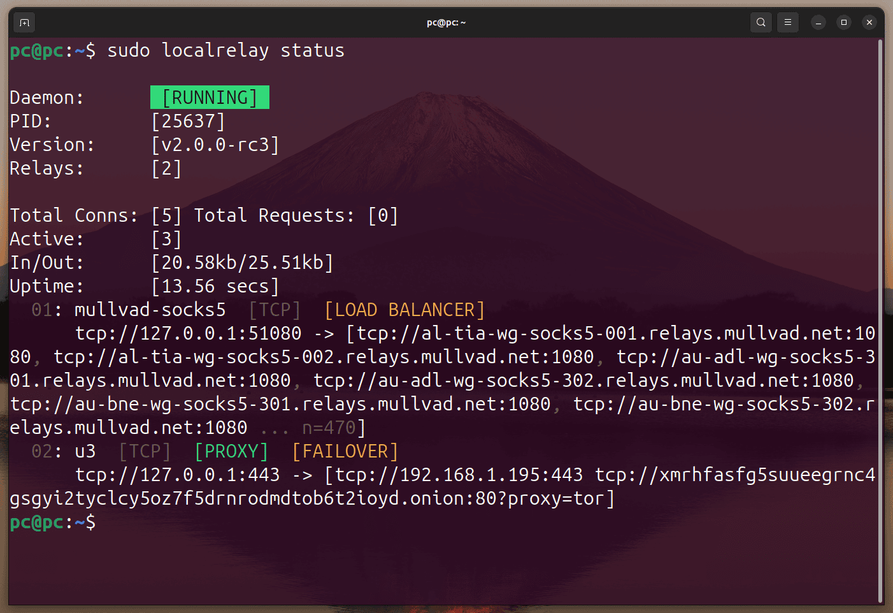
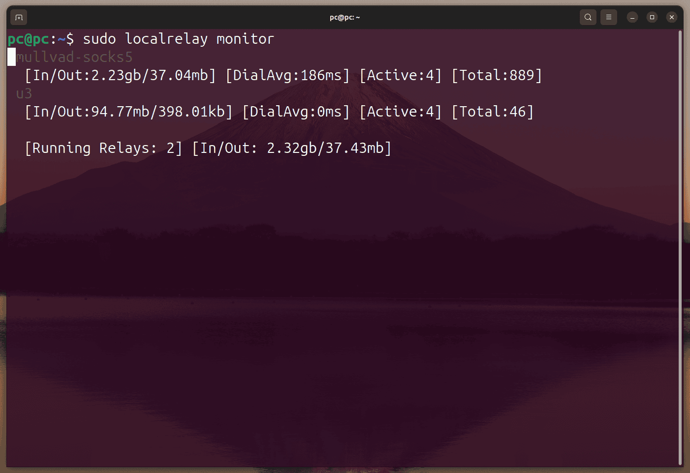
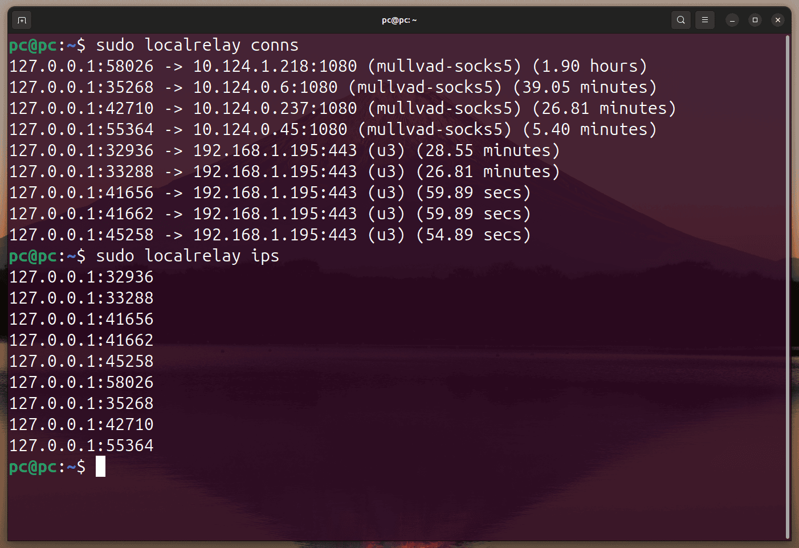
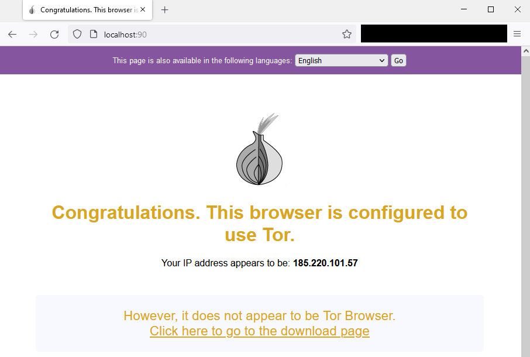

# Localrelay

[](https://github.com/go-compile/localrelay/releases)
[](https://goreportcard.com/report/go-compile/localrelay)
[](https://pkg.go.dev/github.com/go-compile/localrelay)
[](https://hub.docker.com/r/gocompile/localrelay/)
[](https://hub.docker.com/r/gocompile/localrelay/)


Localrelay is a cross platform (Windows, Linux, Mac, Android, and more) reverse proxy which allows the destination address to be customised and can even use a SOCKS5 proxy. Supporting both raw TCP connections and HTTP/HTTPS connections. **Localrelay allows you to host services e.g. Nextcloud on Tor and access it on your mobile or laptop anywhere without needing to open your firewall**.

<div align=center>

**[\[ Wiki & Guide \]](https://github.com/go-compile/localrelay/wiki)**
[\[ Download Release \]](https://github.com/go-compile/localrelay/releases/latest)
[\[ Docker Image \]](https://hub.docker.com/r/gocompile/localrelay)

</div>


## Common Localrelay Use Cases

1. **YOUR HOME LAB AWAY FROM HOME**<br/>
Localrelay is commonly used with failover proxies to allow for custom routing rules based on network connectivity. Connect directly to your home lab via the IP when on your home network, and when away, connect via a hop server or proxy!

> When **home connect directly to the IP**, when away from home **connect with Tor**! Or when away connect via a hop server, or several.

2. **FORCE APPLICATIONS TO USE TOR**<br/>
Another use of Localrelay is force an application which doesn't allow for proxies to use one. For example, you can force Bitwarden to connect over Tor, or force Nextcloud to do the same.

> Protect your IP and force applications to use SOCKS5 proxies even when they don't natively support it, all possible with Localrelay.

3. **FAILOVER ROUTING**<br/>
Prevent service downtime by setting up failover relays for TCP, UDP, HTTP or HTTPS destinations. Localrelay will automatically pick the next available destination and route your traffic over it.

> Stop downtime, setup failover routing to ensure you always have a route to your destination. You can even setup proxy failover, if one SOCKS proxy fails, use another automatically! All can be configured exactly how you wish with a simple config file.

4. **LOADBALANCING WITH FAILOVER**<br/>
Distribute your load evenly, or bias using weights, with Localrelay load balancer.

> Load balance your server connections for HTTP(s), TCP, or UDP. Or setup your browser to load balance between SOCKS5 proxies, giving you a new IP address per website you visit! 

---

If you self host a service for example; [Bitwarden](https://github.com/dani-garcia/vaultwarden), [Nextcloud](https://github.com/nextcloud), [Syncthing](https://github.com/syncthing/syncthing), [Grafana](https://github.com/grafana/grafana), [Gitea](https://github.com/go-gitea/gitea)... You may not want to expose your public IP address to the internet, you may prefer to protect it behind Tor.

Access your local or remote services securely over [Tor](https://www.torproject.org/) without needing to port forward.

Many apps such as Nextcloud, Termis and Bitwarden do not allow you to specify a proxy when connecting to your self-hosted server. Localrelay allows you to host a local reverse proxy on your devices loopback. This relay then encrypts the outgoing traffic through your set SOCKS5 proxy (Tor: 127.0.0.1:9050).

When at **home connect locally**, when away **connect over Tor**. Securely connect remotely over Tor without port forwarding AND when at home connect directly with high speeds.

### Features
- Proxy TCP, UDP, HTTP, and HTTPS connections
- Use SOCKS5 proxies for all remote hosts, some or none, completely customisable!
- Load balance.
- Failover.
- Failover with SOCKS5 proxies.
- Run relays in the background and start at boot.
- View active connections, source, destination, relay and active duration.
- View each relay's bandwidth live (auto updating stats page).
- Drop connections via the CLI.
- Drop all connections from a specified IP.
- Stop, start, restart relays ran by the service.
- CLI to create relay configs.
- Built in HTTP API over a unix socket.
- View all connected IP addresses.

### Manage the Localrelay Service

You can optionally install Localrelay as a service/daemon on Windows, Mac, Linux, and Unix other like systems to **run your relays in the background** and start at boot. 


| Reverse Proxy Screenshots |
|:--:|
|  |
|  |
|  |
| |

### Install & Build

To install Localrelay you can either build from source, or use one of the installers.

- [Install Localrelay for Windows](https://github.com/go-compile/localrelay/wiki/Install)
- [Install Localrelay for Ubuntu and Debian](https://github.com/go-compile/localrelay/wiki/Install)
- [Install Localrelay for Android](https://github.com/go-compile/localrelay/wiki/Install)
- [Install Localrelay Universal Linux](https://github.com/go-compile/localrelay/wiki/Install)
- [Install Localrelay for Mac](https://github.com/go-compile/localrelay/wiki/Install)

## CLI Usage

This is a basic overview, [view the wiki for more detailed information](https://github.com/go-compile/localrelay/wiki/CLI).

### Create Relay

To run a relay you must first create a relay config, this allows for permanent storage of relay configuration and easy management. You can create as many of these as you like.

#### Syntax

```sh
# Create a simple TCP relay
localrelay new <relay_name> -host <bind_addr> -destination <remote_addr>

# Create HTTP relay
localrelay new <relay_name> -host <bind_addr> -destination <remote_addr> -http

# Create HTTPS relay
localrelay new <relay_name> -host <bind_addr> -destination <remote_addr> -https -certificate=cert.pem key=key.pem

# Use proxy
localrelay new <relay_name> -host <bind_addr> -destination <remote_addr> -proxy <proxy_url>

# Set custom output config file
localrelay new <relay_name> -host <bind_addr> -destination <remote_addr> -output ./config.toml

# Create a failover TCP relay
localrelay new <relay_name> -host <bind_addr> -destination <remote_addr_(1)>,<remote_addr_(2)> -failover
```

#### Examples

```sh
# Create a simple TCP relay
localrelay new example.com -host 127.0.0.1:8080 -destination example.com:80

# Create HTTP relay
localrelay new example.com -host 127.0.0.1:8080 -destination http://example.com -http

# Create HTTPS relay
localrelay new example.com -host 127.0.0.1:8080 -destination https://example.com -https -certificate=cert.pem key=key.pem

# Create a TCP relay and store it in the config dir to auto start on system boot (daemon required)
sudo localrelay new example.com -host 127.0.0.1:8080 -destination example.com:80 -store

# Use proxy
localrelay new onion -host 127.0.0.1:8080 -destination 2gzyxa5ihm7nsggfxnu52rck2vv4rvmdlkiu3zzui5du4xyclen53wid.onion:80 -proxy socks5://127.0.0.1:9050

# Create a failover TCP relay with one remote accessed via Tor
localrelay new onion -host 127.0.0.1:8080 -destination 192.168.1.240:80,2gzyxa5ihm7nsggfxnu52rck2vv4rvmdlkiu3zzui5du4xyclen53wid.onion:80 -failover -ignore_proxy=0 -proxy socks5://127.0.0.1:9050
```

<div align="center">
<br>

**[Installation And Usage Guide On The Wiki](https://github.com/go-compile/localrelay/wiki)**

</div>