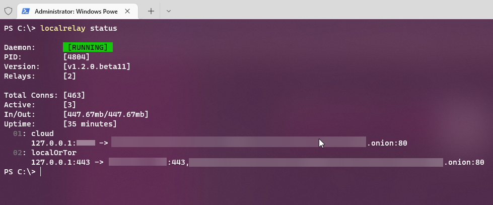
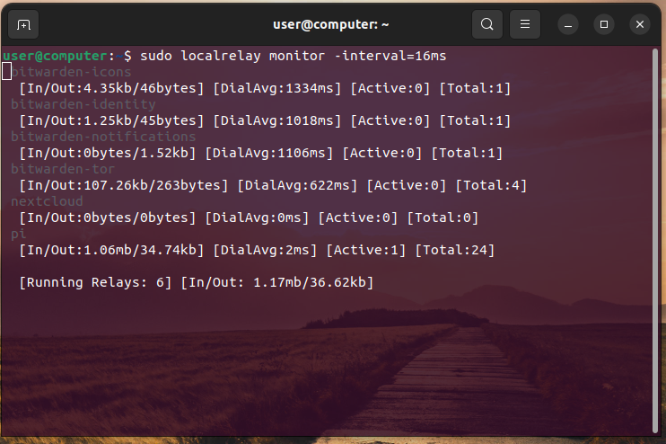

# LocalRelay

[](https://github.com/go-compile/localrelay/releases)
[](https://goreportcard.com/report/go-compile/localrelay)
[](https://pkg.go.dev/github.com/go-compile/localrelay)
[](https://hub.docker.com/r/gocompile/localrelay/)
[](https://hub.docker.com/r/gocompile/localrelay/)


A cross platform CLI & lib which acts as a reverse proxy allowing the destination address to be customised and allows the use of a SOCKS5 proxy. Supporting both raw TCP connections and HTTP/HTTPS connections with options such as; IP locking, Certificate pinning. This app allows you to host services e.g. Nextcloud on Tor and access it on your mobile or laptop anywhere.

<div align=center>

[\[ Download Release \]](https://github.com/go-compile/localrelay/releases/latest) 
[\[ Docker Image \]](https://hub.docker.com/r/gocompile/localrelay)

</div>

# Use Cases

If you self host a service for example; [Bitwarden](https://github.com/dani-garcia/vaultwarden), [Nextcloud](https://github.com/nextcloud), [Syncthing](https://github.com/syncthing/syncthing), [Grafana](https://github.com/grafana/grafana), [Gitea](https://github.com/go-gitea/gitea)... You may not want to expose your public IP address to the internet. Especially considering some self-hosted platforms such as [Plex](https://www.plex.tv/) has been exploited with code execution [vulnerabilities](https://www.cvedetails.com/vulnerability-list.php?vendor_id=14994). You may consider to protect it behind Tor (however this isn't full proof).

Access your local or remote services securely over [Tor](https://www.torproject.org/) without needing to port forward.

Many apps such as Nextcloud, Termis and Bitwarden do not allow you to specify a proxy when connecting to your self-hosted server. Localrelay allows you to host a local reverse proxy on your devices loopback. This relay then encrypts the outgoing traffic through your set SOCKS5 proxy (Tor: 127.0.0.1:9050).

When at **home connect locally**, when away **connect over Tor**. Securely connect remotely over Tor without port forwarding AND when at home connect directly with high speeds.

# This Repository

This repository contains the library written in Go, for it's cross platform capabilities, and contains the CLI application which can be ran on all major operating systems including [Android via Termux](https://termux.com/).

For examples of API usage visit [examples/](https://github.com/go-compile/localrelay/tree/master/examples).

# Library Features

- Create relays with custom remote address
- Proxy remote address through SOCKS5 proxy
- Close relay concurrently
- Verbose logging with custom output (io.Writer)
- Multiple failover proxies for TCP relay
- Failovers for TCP relays
- Select which remote will connect via a proxy
- HTTP relay
  - Http to https
  - Header modification
  - Useragent spoofing
  - Accept language spoofing
  - Proxy using socks5
- Metrics
  - Upload/Download
  - Total connections
  - Active connections
  - Dialler: successes/failures
  - Concurrent safe
  - Dialler 10 point average response time
    - When using Tor this is the circuit build time

# Privacy Proxies

Proxy your services whilst stripping personal information such as User-Agent, accept language or even cookies. Route the traffic through Tor to access the service anywhere in the word even behind a firewall.

<div align="center">


</div>

# CLI Usage

You can download the CLI from the [releases tab](https://github.com/go-compile/localrelay/releases) or compile it your self by building [./cmd/localrelay](https://github.com/go-compile/localrelay/tree/cli.v1.0.0-alpha/cmd/localrelay). All releases hashed with SHA256 and signed.

Once you've downloaded the CLI you will need to give it execute permission if you're on a Unix based system. This is done with `chmod +x localrelay`. You don't need root permission to run the relay nor should you use it even if you want to run on a privileged port. Use `sudo setcap CAP_NET_BIND_SERVICE=+eip /path/to/localrelay` instead.

## Create Relay

To run a relay you must first create a relay config, this allows for permanent storage of relay configuration and easy management. You can create as many of these as you like.

### Syntax

```sh
# Create a simple TCP relay
localrelay new <relay_name> -host <bind_addr> -destination <remote_addr>

# Create HTTP relay
localrelay new <relay_name> -host <bind_addr> -destination <remote_addr> -http

# Create HTTPS relay
localrelay new <relay_name> -host <bind_addr> -destination <remote_addr> -https -certificate=cert.pem key=key.pem

# Use proxy
localrelay new <relay_name> -host <bind_addr> -destination <remote_addr> -proxy <proxy_url>

# Set custom output config file
localrelay new <relay_name> -host <bind_addr> -destination <remote_addr> -output ./config.toml

# Create a failover TCP relay
localrelay new <relay_name> -host <bind_addr> -destination <remote_addr_(1)>,<remote_addr_(2)> -failover
```

### Examples

```sh
# Create a simple TCP relay
localrelay new example.com -host 127.0.0.1:8080 -destination example.com:80

# Create HTTP relay
localrelay new example.com -host 127.0.0.1:8080 -destination http://example.com -http

# Create HTTPS relay
localrelay new example.com -host 127.0.0.1:8080 -destination https://example.com -https -certificate=cert.pem key=key.pem

# Create a TCP relay and store it in the config dir to auto start on system boot (daemon required)
sudo localrelay new example.com -host 127.0.0.1:8080 -destination example.com:80 -store

# Use proxy
localrelay new onion -host 127.0.0.1:8080 -destination 2gzyxa5ihm7nsggfxnu52rck2vv4rvmdlkiu3zzui5du4xyclen53wid.onion:80 -proxy socks5://127.0.0.1:9050

# Create a failover TCP relay with one remote accessed via Tor
localrelay new onion -host 127.0.0.1:8080 -destination 192.168.1.240:80,2gzyxa5ihm7nsggfxnu52rck2vv4rvmdlkiu3zzui5du4xyclen53wid.onion:80 -failover -ignore_proxy=0 -proxy socks5://127.0.0.1:9050
```

# Install/Download

<div align="center">

[Download the appropriate release](https://github.com/go-compile/localrelay/releases) for you platform.

| Operating System/Distro | Recommended File           |
| :---------------------- | :------------------------- |
| Windows                 | localrelay-windows-x64.exe |
| Debian/Ubuntu           | localrelay-linux-64.deb    |
| Linux Other             | localrelay-linux-64        |
| Android                 | localrelay-linux-arm64     |
| Macos                   | localrelay-darwin          |
| Macos (M1)              | localrelay-darwin-arm64    |
| FreeBSD                 | localrelay-freebsd-64      |
| OpenBSD                 | localrelay-openbsd-64      |

</div>

> Depending on your systems arch you will need to select the right
> one. **Most systems are amd64**. If you are running on a Raspberry Pi
> You will want either **arm32** or **arm64**

## Debian/Ubuntu:

Download the deb file and open a terminal in the same directory.

```sh
sudo dpkg -i <localrelay_VERSION_REVISION_ARCH.deb>
```

## Linux Other:

Download the binary file and open a terminal in the same directory.

```sh
# Give executable permissions
chmod +x localrelay-linux-64
# Rename to localrelay
mv localrelay-linux-64 localrelay
# Move to PATH
sudo mv localrelay-linux-64 /usr/bin
```

## Windows:

Steps for Windows 10. The _Environment Variables Settings_ app will be slightly different if you're on Windows 8 or 7.

1. Download the binary file. (ends in .exe)
2. Rename to `"localrelay.exe"`
3. Create a bin directory in documents (or anywhere else). `md %USERPROFILE%\Documents\bin`
4. Copy the binary file to your new directory
5. Open Environment variables settings. Use Windows search to type: _"Edit environment variables"_ and open the application.
6. On the user section (top) click the variable `"Path"` and then the button `"Edit..."`
7. Then click new on the top right corner
8. A input field will apear in the listbox. Input: `%USERPROFILE%\Documents\bin` then press enter.
9. Finally open a NEW cmd window and type `localrelay version`.

## Verify Binary Signature

Make sure to check the binary SHA256 checksum with the signed checksums on the release page against my public GPG key.

## Run Relay

Now you have your relay config toml files we can now launch them using the CLI.

### Syntax

```sh
# Run 1 relay
localrelay run <relay_config>

# Run 2 relays
localrelay run <relay_config1> <relay_config2>

# Run more than 2
# Keep adding the config files to the command
localrelay run <relay_config1> <relay_config2>...
```

### Examples

```sh
# Run 1 relay
localrelay run onion.toml

# Specify dial timeout (for none proxied remotes)
# <num>s  seconds
# <num>ms  milliseconds
# <num>m  minute
localrelay run onion.toml -timeout=5s

# Run 2 relays
localrelay run onion.toml bitwarden.toml

# Run more than 2
# Keep adding the config files to the command
localrelay run onion.toml bitwarden.toml nextcloud.toml piped.toml
```

# Build from Source

This repository contains two code bases. The Localrelay package in the root and the CLI app in `./cmd/localrelay`. To compile the CLI you have two options. Compile for all targets (via the Makefile) or compile directly.

## Compile For Win, Linux & Darwin

Open a terminal in the root of the repository and execute:

```
make
```

## Cross Compile

From windows you can run:

```sh
make cross-compile-win
```

<div align="center">

Produced targets

| Operating System |       Arches       | Packages |
| :--------------- | :----------------: | :------: |
| Windows          | `amd64 i386 arm64` |   None   |
| Linux            | `amd64 i386 arm64` |   Deb    |
| Darwin           |   `amd64 arm64`    |   None   |
| FreeBSD          | `amd64 i386 arm64` |   None   |
| OpenBSD          | `amd64 i386 arm64` |   None   |

The binaries will be placed in `./bin/`.

</div>

From linux you can run:

```sh
make cross-compile-linux
```

<div align="center">

Produced targets

| Operating System | Arches             | Packages |
| :--------------- | :----------------- | :------: |
| Windows          | `amd64 i386`       |   None   |
| Linux            | `amd64 i386 arm64` |   Deb    |
| Darwin           | `amd64 arm64`      |   None   |
| FreeBSD          | `amd64 i386 arm64` |   None   |
| OpenBSD          | `amd64 i386 arm64` |   None   |

The binaries will be placed in `./bin/`.

</div>

## Compile For One Platform

Open a terminal and cd into `./cmd/localrelay`.

```sh
go build -trimpath -ldflags="-s -w"
```

The binary will be created in the current directory (`./cmd/localrelay`).

### Cross Compile

```sh
GOOS=linux GOARCH=amd64 go build -ldflags="-s -w" -trimpath -o ./bin/localrelay-linux-64 ./cmd/localrelay
```

### Build & Install

```sh
git clone github.com/go-compile/localrelay
cd localrelay

go install ./cmd/localrelay

localrelay version
```

# Daemon/Service

If you want Localrelay to start with system boot or just run in the background you can install the daemon. The daemon can be installed on either Windows, Mac or Linux. Currently only Windows and Linux have been tested.

When interfacing with the Daemon **elevated privileges are required** for security. Either run in a administrator CMD window or run with SUDO on Unix based systems.

## Installing Daemon/Service

```sh
# On Unix systems run with sudo
# On Linux the daemon will be installed as a systemd service
sudo localrelay install

# On Windows open a administrator CMD
# On Windows localrelay will be installed as a windows service
# as LocalSystem.
localrelay install
```

## Uninstalling Daemon/Service

```sh
# On Unix systems run with sudo
sudo localrelay stop
sudo localrelay uninstall

# On Windows open a administrator CMD
localrelay stop
localrelay uninstall
```

## Starting a Relay

To run a relay in the background a relay config can be ran with:

```sh
# Add new relay to the Daemon
sudo localrelay run <relay.toml> -detach
```

_Remember on Windows use a admin CMD window_

### Auto Start Relay

If you want relays to auto start when the Daemon starts, you can add the relay configs into the appropriate directory.

#### Windows

```
C:\ProgramData\localrelay\
```

#### Unix

```
/etc/localrelay/
```

_Note elevated privileges may be required._

Now when your system starts or you run `localrelay start` these relays will start too.

### Stop/Restart/Status

To manage the daemon you can use the following commands:

```sh
# Stop the relay and prevent it from auto restarting
sudo localrelay stop

# Stop a single relay
sudo localrelay stop <relay-name>

# Restart the whole service processes
sudo localrelay restart

# Monitor live auto updated metrics
sudo localrelay monitor

# Monitor live auto updated metrics with a custom refresh rate
# ms Micro Seconds
# s Seconds
# m Minutes
# h Hours
# d Days
sudo localrelay monitor -interval=5s

# Monitor live auto updated metrics for specific relays
sudo localrelay monitor <relay-name-(1)> <relay-name-(2)>...

# View relay stats and running relays
sudo localrelay status
```

<div align="center">

> localrelay status



</div>

<div align="center">

> localrelay monitor



</div>

### View Daemon Output/Logs

```sh
# View all logs
journalctl -u localrelayd

# Follow log output
journalctl -u localrelayd -f
```

_Daemon logs: Linux Only_

# Docker

[View on Dockerhub](https://hub.docker.com/r/gocompile/localrelay). Supported arches: `amd64,arm64,arm/v7`. Compressed image size: `<3mb`. Super small light weight, low CPU, RAM and disk usage container perfect for low power devices.

> docker-compose.yaml

```yaml
version: "3"
services:
  localrelay:
    container_name: localrelay
    image: gocompile/localrelay:latest
    network_mode: "host"
    restart: unless-stopped
    volumes:
      - ./localrelay:/etc/localrelay:ro
```

```sh
docker-compose up -d
```

Place your relay configs in ./localrelay/. The configs will be loaded when the relay starts.